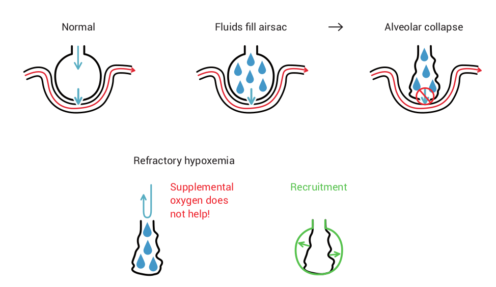
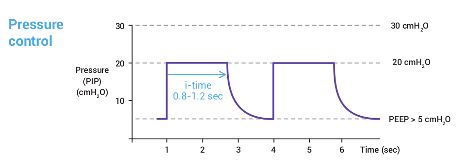

In the last couple of weeks, hundreds of engineers and hobbyists were coming up with creative solutions to help to fight COVID-19 and save human lives. We also tried to come up with safe alternatives to ventilators and we would like to share our conclusions, which might be useful for others. 

## Recommendation ##

**For COVID-19 patients pressure control mode should be used instead of the volume control mode to protect lungs. If the patient has spontaneous breathing APRV or bilevel or CPAP methods are the most lung-protective modes.
When the patient has no breathing a medical ventilator should be used. When the patient has spontaneous breathing can be ventilated using a CPAP machine or an air pump system developed by TU Delft.** 
*Note1: The CPAP machines need to have a filter to avoid ventilating the virus into the air. 
Note2: The device developed by TU Delft is in the phase of clinical testing, as soon as it passes the tests, all the necessary files will be shared on their [website.](https://www.operationair.org/)*

## 1. Mechanical ventilation essentials
To get a better understanding of the topic, I've followed an online course made for professionals (it's free for the duration of COVID-19 outbreak). The course takes about 2 hours, and it walks through the different types of ventilation controls, explains the ventilator parameters, talks about ARDS and pressure control as well.
Link to the course:
[Medmastery-mechanical-ventilation-essentials](https://www.medmastery.com/course/mechanical-ventilation-essentials)

## 2. Volume versus pressure control
When using mechanical ventilation volume control mode and pressure control modes are available.  Patients with COVID-19 have acute respiratory syndrome (ARDS). In ARDS the alveoli of the lungs are affected. **When treating patients with lung disease such as ARDS it is common to switch to pressure control mode because it is more lung-protective!**

[Source: Medmastery-mechanical-ventilation-essentials](https://www.medmastery.com/course/mechanical-ventilation-essentials)

The pressure control mode and why is it suitable for patients with ARDS is explained in the next section.

## 3. Pressure control mode - the patient has no spontaneous breathing
At pressure control mode a max. the pressure is maintained for a couple of seconds, this is the inhalation. Then the pressure is decreasing to the level of min. pressure, this is the exhalation part. Since, the min. the pressure is not zero, the lung is always inflated and the alveoli can't collapse.

[Source: Medmastery-mechanical-ventilation-essentials](https://www.medmastery.com/course/mechanical-ventilation-essentials)

The disadvantage of the pressure control is, that if the patient has spontaneous breathing, it might not match the patients breathing rhythm and it can cause anxiety. In the worst case,(e.g. coughing) it can damage the lungs of the patient.

### Ventilation possibilities when the patient has no spontaneous breathing ###

I. Volume control mode:
  1. Medical ventilator - best solution if available
  2. Ambu bag/ bag valve mask - hand-held - This solution is possible only if enough personnel is available and it was designed to be used only for a couple of hours. 
  3. Ambu bag/ bag valve mask - motorized - There are hundreds of solutions motorizing Ambu bags. **This is a high-risk solution!  It should be kept in mind, that the Ambu bag is designed to be used for a couple of hours. This means, that they need to be continuously monitored by the personnel to detect in time if the bag needs to be changed. Besides, the pressure control mode is more lung-protective, this mode can cause damage to the lungs.**
Although if this is the last solution, then probably the best solution is provided by the [oxygen.protofy.xyz](https://www.oxygen.protofy.xyz/)

II. Pressure control mode:
  1. Medical ventilator - best solution if available
  2. Air pump with sensors and filters - good solution, if tested and clinically approved. The best and safest solution is developed at the TU Delft: [operationair](https://www.operationair.org/en)
  
  When the patient has no spontaneous breathing, using any other device than a medical ventilator is risky.
  
  **Therefore, we suggest, to use alternative solutions on patients, who does have spontaneous breathing as additional support. This way, the recovering patients can be removed from the medical ventilators, and the ventilators can be used on patients who are in worse condition.**
The available possibilities for patients who do have spontaneous breathing are discussed in the next section.
  
  
  
## 4. Pressure control mode - the patient has spontaneous breathing
As already described at the pressure control mode section in this mode a max. the pressure is maintained for a couple of seconds, then the pressure is decreased to the level of min. pressure. Since, the min. the pressure is not zero, the lung is always inflated and the alveoli can't collapse. The disadvantage of the pressure control is, that if the patient has spontaneous breathing, it might not match the patients breathing rhythm and it can cause anxiety. In the worst case,(e.g. coughing) it can damage the lungs of the patient. 
Therefore, if a patient has spontaneous breathing APRV or bilevel pressure control mode is used. 

APRV is a lung-protective control mode that is suitable for patients with ARDS.  It protects lung from exceeding high pressure and the patient can breathe freely.

[Source: Medmastery-mechanical-ventilation-essentials](https://www.medmastery.com/course/mechanical-ventilation-essentials)

### Ventilation possibilities when the patient has spontaneous breathing ###

I. Volume control mode:
  1. Medical ventilator - best solution if available
  2. Ambu bag/ bag valve mask - hand-held - This solution is possible only if enough personnel is available and it was designed to be used only for a couple of hours. 
  3. Ambu bag/ bag valve mask - motorized - There are hundreds of solutions motorizing Ambu bags. **This is an extremely high-risk solution if the patient has spontaneous breathing!  In addition to the fact that Ambu bag is designed to be used for a couple of hours when the patient is coughing or breathing in another rhythm it can damage the lungs!**

II. Pressure control mode:
  1. Medical ventilator - best solution if available
  2. CPAP device - good solution if available, by keeping constant positive pressure, it prevents the alveoli from collapsing. **Important to use filters and masks with CPAP machines otherwise the virus is ventilated from the machine or patient into the air!!**
  3. Ambu bag/ bag valve mask - motorized - with pressure sensors - To keep a constant higher and lower positive pressure the Ambu bag needs to be compressed. When the Ambu bag is empty it needs to be inflated. This results in a negative pressure, that needs to be done fast to avoid collapsing of the alveoli in the lungs. This might work, but it would result in a complex system based on multiple sensors, which works only within given pressure and time values. Keeping in mind, that an Ambu bag works only for a couple of hours, we conclude that an air pump system can provide a safer and more stable solution. Therefore, the time spends on developing a ventilator solution should be focused on developing an air pump system with sensors and filters.
  3. Air pump with sensors and filters - good solution, if tested and clinically approved. The best and safest solution is developed at the TU Delft: [operationair](https://www.operationair.org/en)

## 5. Recommendation ##
  
For COVID-19 patients pressure control mode should be used instead of the volume control to protect the lungs. If the patient has spontaneous breathing APRV or bilevel or CPAP methods are the most lung-protective modes.
When the patient has no breathing a medical ventilator should be used. When the patient has spontaneous breathing can be ventilated using a CPAP machine or an air pump system developed by TU Delft. 
Note: The CPAP machines need to have a filter to avoid ventilating the virus into the air. 
Note: The device developed by TU Delft is in the phase of clinical testing, as soon as it passes the tests, all the necessary files will be shared on their website. [operationair](https://www.operationair.org/)
